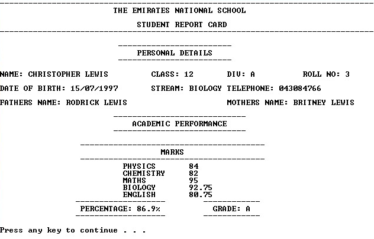

# ReportCardManagementSystem
A C++ program for the management of student records  

  

  

## About the project
* This program named- “Report Card Management System”, aims at helping
teachers and students to work with report cards in an organized manner. It
makes provisions for adding, deleting, displaying and various other
functions on student records. All the records are saved to data files.  
* The program has three access levels- **Teacher, Student and Public**. The
Teacher function (accessed by a password) has administrator rights over the
records and can manipulate the records in any way. The Student and Public
are restricted to the viewership of the records and statistical analysis.

> **Note:**  
   This project was developed for Windows systems using the Dev C++ IDE  
   Record.dat contains sample student records  
   The password to the Teacher is- **ADCDEF**  
   The secure code for each student is accessed by displaying all the records with Teacher privileges  
   Use a window size of **80x25** for the optimal viewing experience  
   Compiled using the **mingw32-gcc-g++** compiler- Version **6.3.0-1** 
